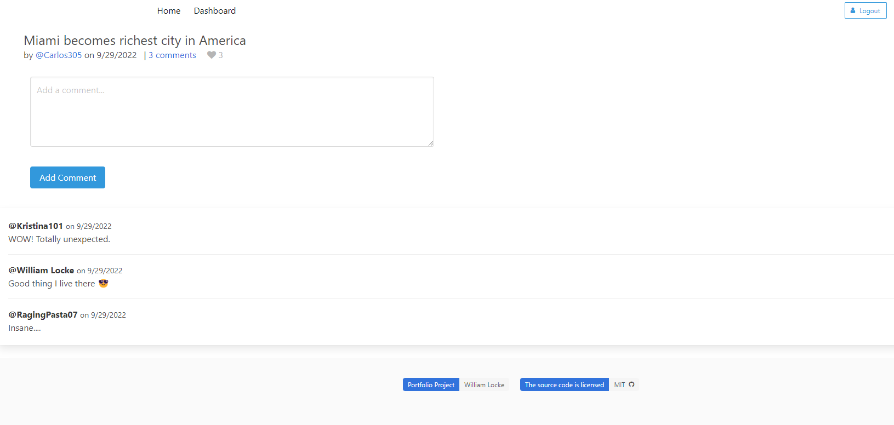

# MVC-CMS Blog App

## Description

A social-media-style CMS Blog application that allows users to register and login by creating a unique, cookie-based session with Express.
The user can create, edit, and delete posts from the database, as well as comment and like posts from other users. 
The back-end controllers manage the routes and SQL queries through Sequelize and MySQL2.
The front-end is generated via the template engine Handlebars.js. This app uses the Bulma CLI for the CSS styling. It also utilizes a RESTful API to communicate with the back-end.

## Screenshot

## Features

- Session expiration
- Support posts with HTML
- User password encryption
- User sessions (Express Session)

## Dependencies and Technologies

- bCrypt
- Connect Session Sequelize
- Dotenv
- Express.js
- Express-Handlebars
- Express-Session
- MySQL2
- Sequelize

## Live Demo

You can access the deployed application [here](https://murmuring-stream-97983.herokuapp.com/).

## Questions

Please send your questions [here](mailto:williamlocke.cello@gmail.com?subject=[GitHub]%20MVC-CMS%20Blog%20App) or visit [my Github](https://github.com/dopecello).

## Credits

* William Locke%    